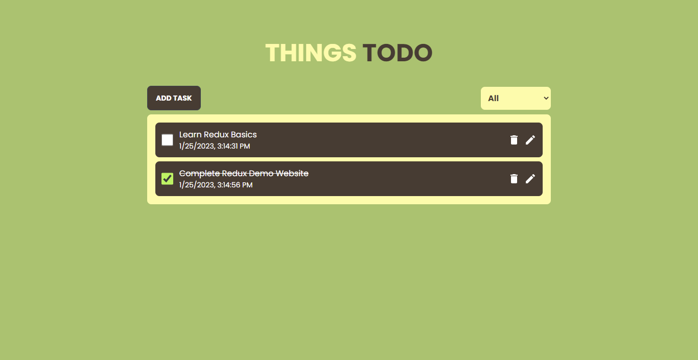

# Live Site - https://things-todo1.netlify.com/

## This is task management demo webiite built using the following technologies:

- **React**: A JavaScript library for building user interfaces
- **Redux**: A state management library for JavaScript applications
- **Tailwind CSS**: A utility-first CSS framework for rapidly building custom designs
- **DaisyUI**: A open-source Tailwind CSS component library
- **Animate.css**: A library of ready-to-use, cross-browser animations

I hope you enjoy using the site! If you have any questions or feedback, please don't hesitate to reach out.

Thank You!
